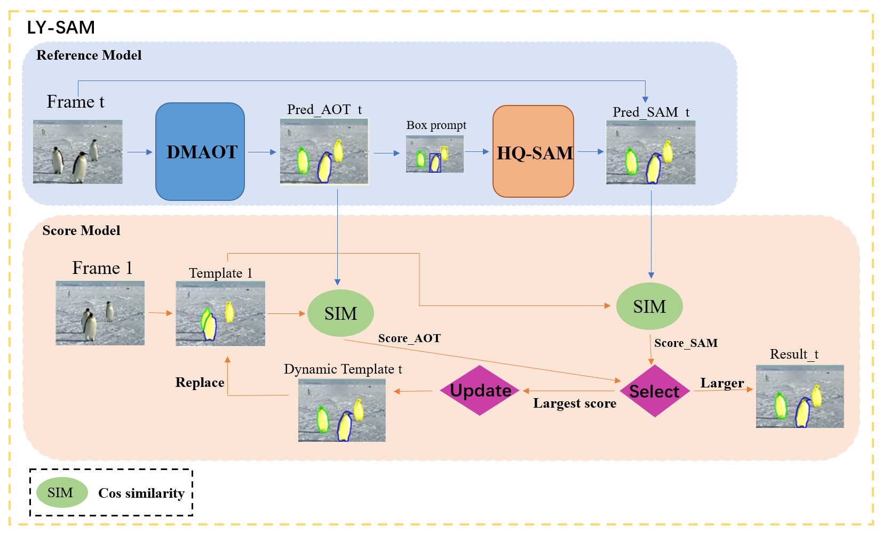

This tracker is based on DMAOT.We obtain the mask and bounding box through DMAOT, and further segmentation through the HQ-SAM model to obtain a new mask, and template updating and score metrics to obtain a more plausible and accurate mask.

<p align="center"> </p>
We use the HQ-SAM model to further segment the boundary of the target by the mask and bounding box obtained from DMAOT to further improve the segmentation ability of the model. The segmentation ability of the SAM model depends entirely on the localization ability of DMAOT, and if a poor bounding box is used, the result of using the SAM segmentation may lead to a reduction in the overall performance of the model. 

## Prerequisites

### Install python packages
- Create a new conda environment
```
conda create -n LYSAM python=3.8
conda activate LYSAM
```
- Then run,
```
bash install.sh
```
### Download pretrained model
- Pretrained models of AOT and DeAOT can be downloaded from [here](https://github.com/yoxu515/aot-benchmark/blob/main/MODEL_ZOO.md).
- We also utilize the SwinB-DeAOT model trained on a larger dataset, and the pretrained weights can be downloaded from [here](https://drive.google.com/file/d/1KTJdR354BtFEGTrA_a4fcKUUHe2woxtn/view?usp=sharing).
- Put the pretrained weight in `./pretrained_models`.
### Download HQ-SAM_h
- HQ-SAM_h can be downloaded from [here](https://drive.google.com/file/d/1qobFYrI4eyIANfBSmYcGuWRaSIXfMOQ8/view?usp=sharing) and put it under
'''
/path/to/LY_SAM/segment_anything_hq/pretrained_model/
'''
## Prepare data
- To initialize the workspace using VOT-Toolkit
```
vot initialize vots2023 --workspace <workspace-path>
```

## Run tracker
### Edit configuration files
- Edit the `paths` and `env_PATH` in `trackers.ini`.
- Edit the `workspace-path` in `evaluate.sh`.
- The detailed documentation on how to use VOT-Toolkit can be found on the [VOT Official website](https://www.votchallenge.net/howto/).

### Get results
```
bash evaluate.sh
```
### Evaluate

- To zip file using VOT-Toolkit
```
vot pack --workspace <workspace-path> <tracker-name>
```
- Upload to [evaluation server](https://eu.aihub.ml/competitions/201). More detail can find in [here](https://www.votchallenge.net/vots2023/participation.html).

## License
This project is released under the BSD-3-Clause license. See [LICENSE](./LICENSE) for additional details.
